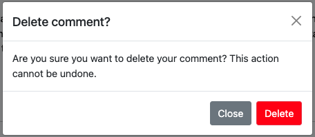

# **Iberico Alex Photography Blog - Portfolio Project 4**

Leveraging the rich tapestry of experiences from my previous projects, I've chosen to further nurture my passion for photography by creating a dedicated blog platform - Iberico Alex Photography. This blog serves as a vibrant hub where enthusiasts and clients alike can delve into the essence of my photographic journey. It's designed to be an interactive space that not only showcases my work but also fosters a community of like-minded individuals. Key Features of Iberico Alex Photography: Curated Blog Posts, Testimonial Showcase, Direct Engagement and an User-Friendly Interface.

Live deployment link can be found [here](https://iberico-alex-blog-5bcad95fbc62.herokuapp.com/).


## **Table of Contents**

1. [User Stories](#user-stories "User Stories")
2. [Design](#design "Design")
   - [Colour](#colour "Colour")
   - [Fonts](#fonts "Fonts")
   - [Wireframes](#wireframes "Wireframes")
3. [Features](#features "Features")
   - [Common Features](#common-features "Common Features")    
   - [Portfolio](#portfolio "Portfolio")
   - [Videos](#videos "Videos")
   - [About](#about "About")
   - [Contact](#contact "contact")
4. [Technologies, Languages & Programs Used](#technologies-languages--programs-used)
5. [Testing](#testing "Testing")
6. [Deployment](#deployment "Deployment")
    - [Version Control](#Version-Control "Version Control")
8. [Credits](#credits "Credits")
    - [Code](#code "Code")
    - [Content](#content "Content")
    - [Design](#design "Design")
    - [Media](#media "Media")

## **User Stories**

### Admin User Stories

-  **User Authentication**
   - User Registration and Login: As an admin, I want to manage user accounts securely.

- **Blog Management**
   - Manage Posts: As an admin, I want the ability to create, edit, and delete any recipe posts.
   - Approve Posts: As an admin, I want to review and approve posts before they are published to maintain content quality.

### User User Stories

- **User Authentication**
   - User Registration and Login: As a user, I want to create accounts and log in securely.

- **Recipe Management**
   - Create and Edit Recipes: As a user, I want to create new recipes and edit existing ones with a user-friendly interface.
   - Image Upload: As a user, I want to add delicious images to my recipes to entice other users.
   - Categorization and Tags: As a user, I want to organize my recipes by categories and add tags for easy searching.

- **User Profiles**
   - UserProfile Model: TastyTales includes a UserProfile model to enhance the user experience.
   - User Information: As a user, I want to provide additional details such as first name, last name, and a profile image.
   - Biography: As a user, I want to share my culinary journey through a bio field.
   - Posted Recipes: As a user, I want to associate myself with the recipes I have created.

- **Social Interaction**
   - Comments and Likes: As a user, I want to engage with the community by commenting on and liking recipes.
   - View Comments: As a user, I want to easily view and interact with comments on posts.
   - Like / Unlike: As a user, I want to express my appreciation for recipes by liking or unliking them.

- **Blog Management**
   - Manage Posts: As an user, I want the ability to create, edit, and delete my recipes.

- **Notifications**
   - Notifications: As a user, I want to receive notifications to stay informed about my recent actions.

- **Search and Discovery**
   - Advanced Search: As a user, I want to find recipes based on ingredients, cuisine, or user profiles.
   - Most Common Tags: As a user, I want to discover popular and trending tags on the platform.

- ### Anonymous User Stories

- **Search and Discovery**
   - View Recipes: As an anonymous user, I want to browse and view recipes on the platform without the ability to engage with them.


NEEDS TO BE UPDATED

- As a **user**, I want **to be able to view a consistent colour scheme across the website** so that it **provides a seamless and harmonious browsing experience**.

- As a **user**, I want **to be able to find and access the navigation bar** so that I can **navigate effortlessly through the platform**.

- As a **user**, I want **to be able to view the footer section** so that I can **find social media links**.

- As a **user**, I want **to be able to explore Iberico Alex's work, including both photos and videos** so that I  **can appreciate the artist's talent and style**.

- As a **user**, I want **to be able to learn more about the photographer** so that I can **ensure that his background and artistic approach align with my preferences**.

- As a **user**, I want **to be able to contact the artist** so that I can **inquire about the services offered**.

### Agile Methodology

The principles of the Agile methodology were applied in an individual capacity during the project development. As the sole contributor, I took on the responsibilities of creating GitHub issues, defining user stories, and utilizing the GitHub Kanban board for project management. Key aspects of the Agile methodology in TastyTales include:

- **User Stories and Issues** (<a href="https://github.com/ibericoalex/iberico-alex-blog/issues" target="_blank" rel="noopener">GitHub Issues</a>): Project tasks were organized into user stories, each corresponding to specific functionalities or improvements. These user stories were then translated into GitHub issues, providing a clear and manageable way to track progress.

- **GitHub Kanban Board** (<a href="https://github.com/ibericoalex/iberico-alex-blog/projects?query=is%3Aopen" target="_blank" rel="noopener">GitHub Project</a>): The GitHub Kanban board was leveraged to visualize and manage the project's workflow. It facilitated the organization of tasks, from backlog to completion, providing a visual representation of the project's status.

By adopting Agile principles, it helped me to developed with a focus on adaptability and responsiveness, resulting in a platform that aligns with user needs and delivers a satisfying user experience.


## **Design**
For this project, I drew inspiration from the previous [PP1 project](https://ibericoalex.github.io/iberico-alex-photography/) to ensure consistency. The website features a bold, minimalist, and sleek design that perfectly aligns with my artistic vision and work.

All the images presented in the project are exclusively captured and owned by me.


### **Colour**
I used the same color code - bold colors like red, black, and white to represent my artistic brand. These colors not only enhance the visual appeal but also ensure easy readability for users. To generate the color scheme, I utilized [Coolors.co](https://coolors.co/ff0000-0d0d0d-fafafa-525252).


### **Fonts**
I incorporated fonts from [Google Fonts](https://fonts.google.com/) into my website. I mainly used Lato and Roboto. These font choices add a stylish and cohesive touch to the overall design.

### **Wireframes**
Before proceeding with any HTML, CSS, Python and JavaScript coding, I made use of Balsamiq to create wireframes for my whoe website. By establishing a clear blueprint through wireframes, I could confidently proceed with the development process.

- Home/Blog page


- Blog Post page


- Testimonials page


- About page


- Register page


- Login page


- Logout page


## **Features**
### **Common Features**
As the user navigates through the website, the following elements consistently appear across every page. These elements maintain a cohesive presence throughout the user's browsing experience.

 - **Logo and Navigation Bar** 
    The logo and navigation bar are prominently displayed on every page of the website. These elements have been carefully designed and optimized to ensure seamless functionality across various screen sizes. The logo serves as a clickable link, directing users back to the homepage/portfolio. Additionally, each link within the navigation menu accurately leads users to the corresponding page, enhancing the overall user experience.

    Worth mentioning, once we access the website through a mobile, the menu collapses - hamburger menu - and allows to toggle the navigation links.

    - Desktop menu
    

    - Mobile menu (closed)
    

    - Mobile menu (open)
    

- **Favicon**
    The favicon displayed on the browser tab encapsulates the branding of Iberico Alex Photography, providing a small yet impactful visual representation of the website's identity.

    

- **Footer**
    The footer is consistently visible on every page of the website. It features social media icons that are linked to the corresponding social media platforms, allowing users to easily connect and stay updated with the photographer on these platforms. This enables seamless access to the artist's social media presence and encourages users to stay connected and engaged with their latest updates.

    

### **Blog Page**

The landing page serves as the initial entry point for users when they first visit the website. It prominently showcases the blog entires curated by the photographer, providing interesting insights into photographic topics.

The layout is inspired by Code Institute's "I think therefor I blog" Django project. And have been carefully adapted to stay aligned with my bold and minimal design. 

When hovering over the text, the color changes to red indicating the selected blog entry. The ultimate goal is for the User to click on the post entry and access the complete post. 

Additional noteworthy features include:
- The blog entries are fully responsive, adjusting the column count based on the screen size for optimal viewing.
- Pagination available on the bottom of the Blog entries, allowing the User to navigate to previous entries.
- Mention of update date directly below the blog entry.


### **Blog Post Page**

The Individual Blog Entry page features the whole blog entry. Users can find relevat information about when the post was created (which differs from the update date shown on the Glog page), the content of the post, a comment section - allowing Users to comment and interact with each other and finally on the lefthand side we can find the leave a comment form section - space that allows users to input their comments.

The ultimate goal would be to add like buttons and User's profile image. Unfortunately, due to time constraints, this was not possible at this stage, but definitely something I would like to pursue given the opportunity.


### **Testimonials Page**

Users are prompted to leave their testimonials of their experiance with Iberico Alex. Here they can quickly have an overview of previous testimonials and can use the testimonial form to leave their feedback.


### **About Page**

This page serves as an opportunity for users to delve deeper into the photographer's background and learn more about his artistic journey and expertise.

Additionally, they can contact the photogapher directly through the **Get in touch** form. This provides users with a convenient means to directly reach out to the photographer and inquire about their services. The contact form, which includes required fields, ensures that all necessary information is correctly filled out.


### **Register / Login / Logout**

The Register, Login and Lougout pages maintain their basic style and layout, only the content was amended for consitency. The forms in both Register and Sign In page prompt required fields, ensuring that all necessary information is correctly provided.

- Register page


- Login page


- logout page


### **Alert Messages**
- Submit comment


- Edit comment


- Delete comment


- Delete confirmation modal


- Leave testimonial


- Submit inquiry request


- Log in message


- Log out message


### **Future Features**
- Add profile image to users account
- Permission to like and unlike a post
- Implement a favorites system, allowing users to save their favorite blog posts


## **Technologies, Languages & Programs Used**

* [HTML](https://www.w3schools.com/html/): Markup language for creating web pages.
* [CSS](https://www.w3schools.com/CSS/): Stylesheet language for styling the appearance of web pages.
* [JavaScript](https://www.w3schools.com/js/): Programming language that is one of the core technologies of the World Wide Web, alongside HTML and CSS.
* [Python](https://www.python.org/): Used as the back-end programming language.
* [Git](https://git-scm.com/): Used for version control (git add, git commit, git push).
* [GitHub](https://github.com/): Web-based platform for version control and collaboration on software projects.
* [GitPod](https://gitpod.io/): Cloud-based integrated development environment (IDE) for coding, collaborating, and deploying projects.
* [Bootstrap](https://getbootstrap.com/): Bootstrap used as the front-end CSS framework for modern responsiveness and pre-built components.
* [Django](https://www.djangoproject.com/): Used as the Python framework for the site.
* [PostgreSQL](https://www.postgresql.org/): Used as the relational database management.
* [ElephantSQL ](https://www.elephantsql.com/): Used as the Postgres database.
* [Cloudinary](https://cloudinary.com/): Used for online static file storage.
* [Heroku](https://heroku.com/): a cloud platform as a service supporting several programming languages.
* [CI PEP8 Online](https://pep8ci.herokuapp.com/): CI Python Linter - Tool to check and enforce python coding standards.
* [Google Fonts](https://fonts.google.com/): Library of free and open-source web fonts.
* [Google Lighthouse](https://developer.chrome.com/docs/lighthouse/overview/): Automated tool for auditing and improving web page quality.
* [W3C Validator](https://validator.w3.org/): Tool for checking HTML and CSS code compliance with web standards.
* [VSCode](https://code.visualstudio.com/): Free and highly extensible source code editor with built-in features for editing, debugging, and version control integration. It supports various programming languages and is available for multiple platforms.
* [ChatGPT](https://chat.openai.com/): Artificial intelligence chatbot.
* [Balsamiq Wireframes](https://balsamiq.com/wireframes/): Rapid low-fidelity UI wireframing tool.
* [Techsini](https://chat.openai.com/): Mockup generator.

## **Testing**

Testing available [here](./documentation/TESTING.md)

## Project Deployment Guide

The deployed version of the application is accessible on [Heroku](https://iberico-alex-blog-5bcad95fbc62.herokuapp.com/).

### Setting Up ElephantSQL for PostgreSQL

This application utilizes [ElephantSQL](https://www.elephantsql.com) for managing its PostgreSQL database.

To set up your PostgreSQL database with ElephantSQL, follow these instructions:
- Navigate to **Create New Instance** to initiate a new database setup.
- Name your database instance, ideally using your project's name for easy identification.
- Opt for the **Tiny Turtle (Free)** tier for your plan selection.
- The **Tags** section can be skipped unless needed.
- Choose a **Region** and **Data Center** that is geographically close to you for optimal performance.
- Upon instance creation, select your database to view and note down the URL and Password for later use.

### Integrating Cloudinary for Media Storage

For online media asset management, this project integrates with [Cloudinary](https://cloudinary.com). This is particularly useful since Heroku does not offer persistent storage for media files.

To get started with Cloudinary:
- Sign up and log into your Cloudinary account.
- When asked for your *Primary interest*, select *Programmable Media for image and video API*.
- You have the option to customize your cloud name for easier recall.
- Your Cloudinary Dashboard will provide you with an **API Environment Variable**.
- Important: Exclude `CLOUDINARY_URL=` from the API **value** when setting it up in your environment; this part is considered the **key**.

### Deploying on Heroku

For cloud-based application hosting, this project leverages [Heroku](https://www.heroku.com).

Follow these steps to deploy your application on Heroku:
- In your Heroku Dashboard, click **New** at the top-right, then choose **Create new app**.
- Choose a unique name for your app and select a region closest to you, then click **Create App**.
- Under your app's **Settings**, find and click **Reveal Config Vars** to input your environment variables as follows:

| Key                   | Value                               |
| --------------------- | ----------------------------------- |
| `CLOUDINARY_URL`      | Your Cloudinary API key            |
| `DATABASE_URL`        | Your ElephantSQL database URL      |
| `SECRET_KEY`          | A secret key of your choosing      |

Heroku requires two specific files for deployment:
- `requirements.txt`
- `Procfile`

Install the necessary project **requirements** with:
- `pip3 install -r requirements.txt`

To update your `requirements.txt` file with any new packages, use:
- `pip3 freeze --local > requirements.txt`

Create a **Procfile** with the command:
- `echo web: gunicorn your_django_app_name.wsgi > Procfile`
- Note: Replace `your_django_app_name` with the name of your main Django app directory.

To deploy on Heroku, connect your GitHub repository to the Heroku app by either:
- Choosing **Automatic Deployment** in the Heroku app settings.

Or by using the Terminal/CLI:
- Log in to Heroku with `heroku login -i`.
- Set Heroku as a remote with `heroku git:remote -a your_app_name`.
- After pushing your changes to GitHub, deploy to Heroku with `git push heroku main`.

Your application should now be live on Heroku!

### Local Setup

For local development, you can clone or fork this project:

Ensure you have all necessary packages by installing them from the *requirements.txt* file:
- `pip3 install -r requirements.txt`.

Create a `env.py` file at the project root and set up the same environment variables as in the Heroku deployment steps, plus any local-specific ones:

```python
import os

os.environ.setdefault("CLOUDINARY_URL", "Your Cloudinary API key")
os.environ.setdefault("DATABASE_URL", "Your ElephantSQL database URL")
os.environ.setdefault("SECRET_KEY", "A secret key of your choice")

# For local development only
os.environ.setdefault("DEBUG", "True")
```

To run the project locally:
- Start the Django server with `python3 manage.py runserver`.
- Stop the server using `CTRL+C` or `⌘+C` on Mac.
- Apply necessary migrations with `python3 manage.py makemigrations` followed by `python3 manage.py migrate`.
- Create a superuser for admin access with `python3 manage.py createsuperuser`.
- If you have fixture files, load them with `python3 manage.py loaddata file-name.json`.
- Restart the server with `python3 manage.py runserver`.

#### Cloning the Project

To clone the repository for local development:
1. Visit the [GitHub repository](https://github.com/adamgilroy22/tribe).
2. Click the **Code** button and copy the URL under HTTPS, SSH, or GitHub CLI.
3. Open your terminal and navigate to the directory where you want the cloned directory.
4. Type `git clone https://github.com/ibericoalex/iberico-alex-blog.git` and press Enter.

For Gitpod users, you can start a workspace with this repository by clicking the Gitpod button. Ensure you have the Gitpod browser extension installed for this to work seamlessly.

#### Forking the Repository

Forking allows you to copy the repository to your GitHub account, enabling you to make changes without affecting the original repository:
1. Log in to GitHub and navigate to [GitHub Repository](https://github.com/ibericoalex/iberico-alex-blog).
2. Locate and click the "Fork" Button at the top-right.
3. You should now have a copy of the repository in your account.

## **Credits**

### **Code**
- Most of the code was used from the **I Think Therefore I Blog" Code Institue Project.
- App's models, views and forms were created and adapted taking into account the information provided during CI's Django curriculum content. 
- Help from my mentor Akshat, who verified and approved the code
 
### **Content**
- I personally wrote relevant sections on the website and used ChatGPT to populate the blog entries (due to its extense content). The content was then refined and corrected with the help of ChatGPT, including the README file.

### **Design**
- Wireframes were created using [Balsamiq](https://balsamiq.com/)
- The color scheme was carefully validated for readability using [Webaim](https://webaim.org/resources/contrastchecker/)

### **Media**
- The favicon was designed and created by me using Adobe Photoshop.
- All the photos displayed on the website were captured by me.

## **Acknowledgements**
My heartfelt thanks to my mentor, Akshat Garg. His invaluable guidance and unwavering support were crucial to this project's success. I deeply appreciate his promptness and dedication throughout my journey.
