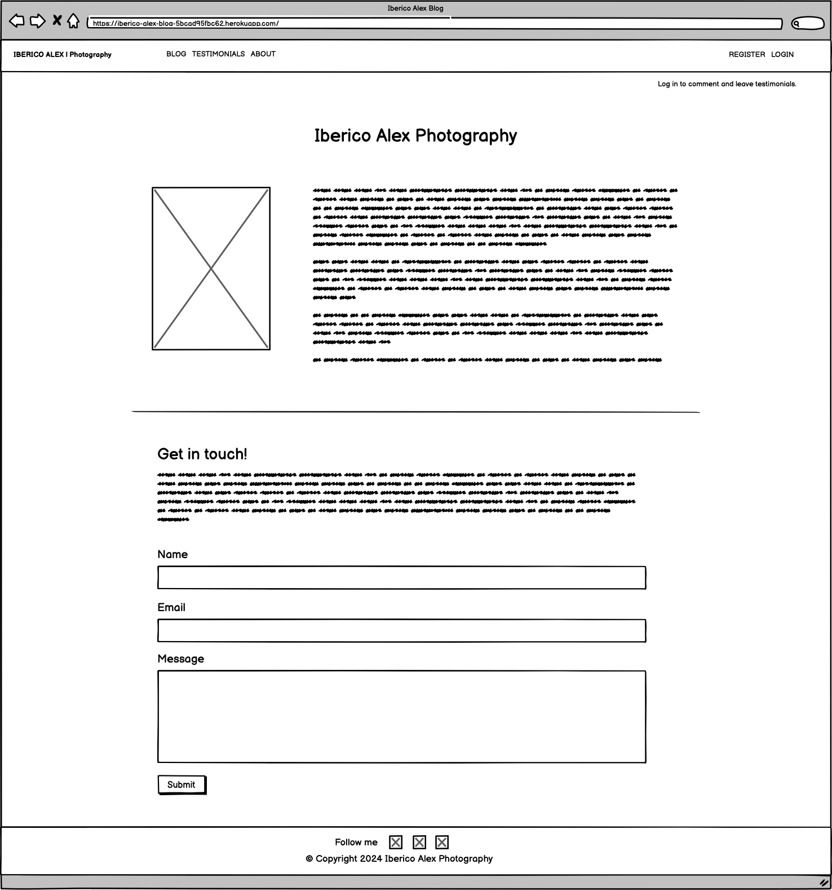

# **Iberico Alex Blog - Portfolio Project 4**

Building on the rich experiences from my previous projects, I've decided to further explore my passion for photography by creating a dedicated blog platform - Iberico Alex Photography. This blog is designed as a dynamic space where both enthusiasts and clients can immerse themselves in my photographic journey, featuring curated blog posts, a testimonial showcase, direct engagement opportunities, and a user-friendly interface.

The live deployment of the blog can be accessed [here](https://iberico-alex-blog-5bcad95fbc62.herokuapp.com/).

## **Table of Contents**

1. [Introduction](#iberico-alex-blog---portfolio-project-4)
2. [User Stories](#user-stories)
   - [Admin User Stories](#admin-user-stories)
   - [Regular User Stories](#regular-user-stories)
   - [Anonymous User Stories](#anonymous-user-stories)
   - [Agile Methodology](#agile-methodology)
3. [Design](#design)
   - [Colour Scheme](#colour-scheme)
   - [Typography](#typography)
   - [Wireframes](#wireframes)
4. [Features](#features)
   - [Common Features](#common-features)
   - [Blog Page](#blog-page)
   - [Blog Post Page](#blog-post-page)
   - [Testimonials Page](#testimonials-page)
   - [About Page](#about-page)
   - [Register / Login / Logout](#register--login--logout)
   - [Alert Messages](#alert-messages)
   - [Features for Future Releases](#features-for-future-releases)
5. [Technologies Used](#technologies-used)
6. [Database Design - ERD Tables](#database-design---erd-tables)
   - [User Model](#user-model-djangos-built-in-user-model)
   - [About Model](#about-model)
   - [Post Model](#post-model)
   - [Comment Model](#comment-model)
   - [Testimonials Model](#testimonials-model)
   - [Relationships Summary](#relationships-summary)
7. [Testing](#testing)
8. [Deployment](#deployment)
9. [Credits](#credits)
   - [Code](#code)
   - [Content](#content)
   - [Media](#media)
   - [Acknowledgements](#acknowledgements)

## **User Stories**

### Admin User Stories

- **User Authentication**
   - As an admin, I want to securely manage user accounts through user registration and login functionalities.

- **Blog Management**
   - As an admin, I want the ability to create, edit, and delete blog posts to keep the content fresh and relevant.
   - As an admin, I want to review and approve comments and testimonials before they are published to ensure the quality of the content.

### Regular User Stories

- **User Authentication**
   - As a user, I want to create accounts and log in securely to interact with the blog.

- **Blog Interaction**
   - As a user, I want to comment on blog posts and edit my comments to engage with the content.
   - As a user, I want to leave testimonials to share my feedback and experiences.
   - As a user, I want to easily contact the photographer for inquiries or services.

- **Notifications**
   - As a user, I want to receive notifications to stay informed about my interactions with the blog.

### Anonymous User Stories

- **Content Discovery**
   - As an anonymous user, I want to browse and view blog posts without the need to engage with them.
   - As an anonymous user, I want to read testimonials to understand others' experiences.
   - As an anonymous user, I want an easy way to contact the photographer.

### Agile Methodology

The development of this project was guided by Agile principles, adapted for solo development. Key Agile practices included:

- **User Stories and Issues** (<a href="https://github.com/ibericoalex/iberico-alex-blog/issues" target="_blank" rel="noopener">GitHub Issues</a>): Defined user stories were translated into GitHub issues to organize and prioritize development tasks.
- **GitHub Kanban Board** (<a href="https://github.com/ibericoalex/iberico-alex-blog/projects?query=is%3Aopen" target="_blank" rel="noopener">GitHub Project</a>): Utilized for visual project management, facilitating a clear overview of the project's progress from conception to completion.

## **Design**

Inspired by my previous [PP1 project](https://ibericoalex.github.io/iberico-alex-photography/), the website features a bold, minimalist design that reflects my artistic vision. All images are my original work, showcasing my photography.

### **Colour Scheme**

The color palette consists of bold colors like red, black, and white, chosen for their visual impact and readability. The scheme was generated using [Coolors.co](https://coolors.co/ff0000-0d0d0d-fafafa-525252).

### **Typography**

The website's typography features Lato and Roboto fonts from [Google Fonts](https://fonts.google.com/), enhancing the site's aesthetic and readability.

### **Wireframes**

Wireframes were created using Balsamiq to plan the website's layout before development began, ensuring a structured approach to the design and functionality.

- Home/Blog page

- Blog Post page

- Testimonials page

- About page

- Register page

- Login page

- Logout page

## **Features**

### **Common Features**
Throughout the website, certain elements provide a consistent user experience on every page, ensuring a cohesive and intuitive navigation journey.

- **Logo and Navigation Bar**: 
  The logo and navigation bar are strategically placed on every page, designed for seamless functionality across devices. The logo doubles as a home button, guiding users back to the main page, while the navigation links offer direct access to various sections of the site. On mobile devices, the navigation collapses into a hamburger menu, streamlining the user interface.

  - Desktop View:
  
    

  - Mobile View (Collapsed):
  
    

  - Mobile View (Expanded):
  
    

- **Favicon**: 
  A distinctive favicon represents the Iberico Alex Photography brand in browser tabs, enhancing brand recognition and adding a professional touch.

  

- **Footer**: 
  The footer, consistent across the site, links to social media platforms, encouraging users to connect with the photographer beyond the website. This feature supports community engagement and brand visibility.

  

### **Blog Page**

The Blog Page acts as the gateway to the photographer's world, displaying curated blog entries that delve into various photographic themes. Inspired by the "I Think Therefore I Blog" project from Code Institute, the design has been tailored to match the site's bold and minimalist aesthetic.

- Responsive Design: The layout dynamically adjusts to the screen size, ensuring an optimal viewing experience on any device.
- Interactive Elements: Hovering over a blog entry highlights it in red, inviting users to click and read further.
- Pagination: Allows users to explore more entries, enhancing discoverability.
- Update Dates: Each entry displays its last update date, keeping content transparency.

### **Blog Post Page**

This page offers a deep dive into individual blog entries, presenting the full content, creation date, and a section for user comments, fostering a community dialogue.

- Comment Section: Enables users to engage with the content and each other, enriching the blog's interactive experience.
- Future Enhancements: Plans include adding like buttons and user profile images to further personalize the interaction.

### **Testimonials Page**

A platform for users to share their experiences with Iberico Alex, enhancing the site's credibility and community feel.

- Overview of Testimonials: Allows new visitors to gauge the photographer's impact through past client feedback.
- Testimonial Submission: Users can easily leave their own testimonials, contributing to the site's content.

### **About Page**

Delve into the photographer's artistic journey and ethos, offering a personal connection with the audience.

- Direct Contact: The integrated "Get in touch" form simplifies inquiries, making it straightforward for users to engage with the photographer.

### **Register / Login / Logout**

Designed for simplicity and consistency, these pages facilitate secure user interactions with the site.

- Register Page: Streamlines new user onboarding with a straightforward form.
  
  

- Login Page: Offers existing users a simple login interface.
  
  

- Logout Page: Confirms user logout, ensuring a secure exit.
  
  

### **Alert Messages**

Enhances user feedback with clear, concise messages following various actions, such as commenting, testimonial submissions, and account management.

- Comment Submission:
  
  

- Comment Editing:
  
  

- Comment Deletion:
  
  

- Testimonial Submission:
  
  

- Inquiry Submission:
  
  

- Login/Logout Notifications:
  
  
  
  

### **Features for Future Releases**

- **User Profiles**: Enhance personalization with customizable user profiles, including profile pictures.
- **Like and Unlike Functionality**: Introduce interactive elements allowing users to express their preferences.
- **Favorites System**: Enable users to bookmark their favorite blog posts, creating a personalized content library.

## **Technologies Used**

- **Frontend**: HTML, CSS, JavaScript
- **Backend**: Python, Django
- **Database**: PostgreSQL, ElephantSQL
- **Static Files**: Cloudinary
- **Deployment**: Heroku
- **Version Control**: Git, GitHub
- **Design**: Balsamiq, Google Fonts, Coolors.co
- **Testing**: W3C Validator, Google Lighthouse

Click to view extensive technologies list and functions

* [HTML](https://www.w3schools.com/html/): Markup language for creating web pages.
* [CSS](https://www.w3schools.com/CSS/): Stylesheet language for styling the appearance of web pages.
* [JavaScript](https://www.w3schools.com/js/): Programming language that is one of the core technologies of the World Wide Web, alongside HTML and CSS.
* [Python](https://www.python.org/): Used as the back-end programming language.
* [Git](https://git-scm.com/): Used for version control (git add, git commit, git push).
* [GitHub](https://github.com/): Web-based platform for version control and collaboration on software projects.
* [GitPod](https://gitpod.io/): Cloud-based integrated development environment (IDE) for coding, collaborating, and deploying projects.
* [Bootstrap](https://getbootstrap.com/): Bootstrap used as the front-end CSS framework for modern responsiveness and pre-built components.
* [Django](https://www.djangoproject.com/): Used as the Python framework for the site.
* [PostgreSQL](https://www.postgresql.org/): Used as the relational database management.
* [ElephantSQL ](https://www.elephantsql.com/): Used as the Postgres database.
* [Cloudinary](https://cloudinary.com/): Used for online static file storage.
* [Heroku](https://heroku.com/): a cloud platform as a service supporting several programming languages.
* [CI PEP8 Online](https://pep8ci.herokuapp.com/): CI Python Linter - Tool to check and enforce python coding standards.
* [Google Fonts](https://fonts.google.com/): Library of free and open-source web fonts.
* [Google Lighthouse](https://developer.chrome.com/docs/lighthouse/overview/): Automated tool for auditing and improving web page quality.
* [W3C Validator](https://validator.w3.org/): Tool for checking HTML and CSS code compliance with web standards.
* [VSCode](https://code.visualstudio.com/): Free and highly extensible source code editor with built-in features for editing, debugging, and version control integration. It supports various programming languages and is available for multiple platforms.
* [ChatGPT](https://chat.openai.com/): Artificial intelligence chatbot.
* [Balsamiq Wireframes](https://balsamiq.com/wireframes/): Rapid low-fidelity UI wireframing tool.
* [Techsini](https://chat.openai.com/): Mockup generator.

## Database Design - ERD Tables

- ### User Model (Django's built-in User model)

| User Attributes | Type/Relation | Notes |
|-----------------|---------------|-------|
| username        | CharField     | Provided by Django's auth system |
| email           | EmailField    | Provided by Django's auth system |

- ### About Model

| About Attributes | Type/Relation      | Notes                          |
|------------------|--------------------|--------------------------------|
| title            | CharField          | max_length=200                 |
| profile_image    | CloudinaryField    | 'image', default='placeholder' |
| updated_on       | DateTimeField      | auto_now=True                  |
| content          | TextField          |                                |

- ### Post Model

| Post Attributes  | Type/Relation      | Notes                          |
|------------------|--------------------|--------------------------------|
| title            | CharField          | max_length=200, unique=True    |
| slug             | SlugField          | max_length=200, unique=True    |
| author           | ForeignKey(User)   | related_name="blog_posts"      |
| featured_image   | CloudinaryField    | 'image', default='placeholder' |
| content          | TextField          |                                |
| created_on       | DateTimeField      | auto_now_add=True              |
| status           | IntegerField       | choices=STATUS, default=0      |
| excerpt          | TextField          | blank=True                     |
| updated_on       | DateTimeField      | auto_now=True                  |

- ### Comment Model

| Comment Attributes | Type/Relation     | Notes                          |
|--------------------|-------------------|--------------------------------|
| post               | ForeignKey(Post)  | related_name="comments"        |
| author             | ForeignKey(User)  | related_name="commenter"       |
| body               | TextField         |                                |
| approved           | BooleanField      | default=False                  |
| created_on         | DateTimeField     | auto_now_add=True              |
| updated_on         | DateTimeField     | auto_now=True                  |

- ### Testimonials Model

| Testimonials Attributes | Type/Relation     | Notes                      |
|-------------------------|-------------------|----------------------------|
| author                  | ForeignKey(User)  | related_name="testimonials_posts" |
| content                 | TextField         |                            |
| created_on              | DateTimeField     | auto_now_add=True          |
| status                  | IntegerField      | choices=STATUS, default=0  |

## Relationships Summary

- User to Post: One-to-Many (A user can author multiple posts)
- Post to Comment: One-to-Many (A post can have multiple comments)
- User to Comment: One-to-Many (A user can author multiple comments)
- User to Testimonials: One-to-Many (A user can author multiple testimonials)

## **Testing**

Detailed testing documentation can be found [here](./documentation/TESTING.md).

## **Deployment**

This project is deployed on Heroku. Detailed deployment instructions and setup for local development are available in the project's [deployment guide](.documentation/DEPLOYMENT.md).

## **Credits**

### **Code**

- The blog's structure was inspired by the "I Think Therefore I Blog" project from Code Institute.
- The architecture of the application, including models, views, and forms, was meticulously developed with insights and best practices gleaned from the Code Institute's Django curriculum. This foundational knowledge was instrumental in crafting a robust and functional application that adheres to industry standards.

### **Content**

- The content for the blog posts was generated with the assistance of ChatGPT and personalized to fit the blog's theme.

### **Media**

- All photographs displayed on the website are my original work.

### **Acknowledgements**

Special thanks to my mentor, Akshat Garg, for his invaluable guidance and support throughout the development of this project.
