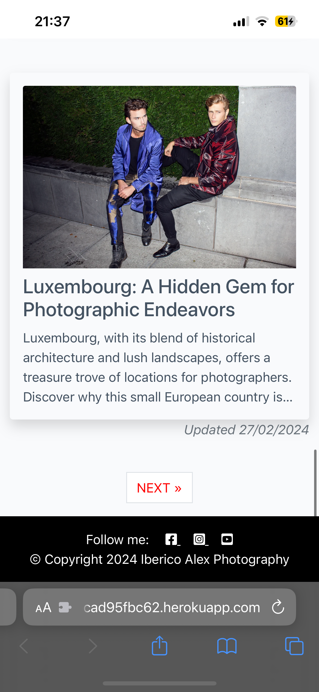

## **Table of Contents**

1. [Testing](#testing "Testing")
   - [User Testing](#user-testing "User Testing")
   - [Manual Testing](#manual-testing "Manual Testing")
   - [Cross-browser Testing](#cross-browser-testing "Cross-browser Testing")
   - [Compatability and Responsiveness Testing](#compatability-and-responsiveness-testing "Compatability and Responsiveness Testing")
2. [Bugs](#bugs "Bugs")
3. [Validator Testing](#validator-testing "Validator Testing")
   - [HTML Validator](#html-validator "HTML Validator")    
   - [CSS Validator](#css-validator "CSS Validator")
   - [Performance Testing](#performance-testing "Performance Testing")

    
    ## **Testing**

### **User Testing**
After deploying the site, I shared the link with my family and friends for testing purposes, and I received positive feedback from everyone. They found the site easy to navigate, and it displayed beautifully on all of their devices without any issues.

### **Manual Testing**
Thorough manual testing was conducted during the project's development, aligning with the User Stories. The final results of the testing are provided below.

- As a **user**, I want **to be able to view a consistent colour scheme across the website** so that it **provides a seamless and harmonious browsing experience**.

| **Test** | Issue | Result |
| -------- | ----- | ------ |
| 1        | The website features a consistent color palette, maintaining visual harmony throughout. | PASS   |

- As a **user**, I want **to be able to find and access the navigation bar** so that I can **navigate effortlessly through the platform**.

| **Test** | Issue | Result |
| -------- | ----- | ------ |
| 2        | The navigation bar appears on every page, ensuring seamless user navigation between pages. | PASS   |

- As a **user**, I want **to be able to view the footer section** so that I can **find social media links**.

| **Test** | Issue | Result |
| -------- | ----- | ------ |
| 3        | The footer appears on every page of the website, featuring social media links that enhance and complement the overall site experience. | PASS   |

- As a **user**, I want **to be able to explore Iberico Alex's work, including both photos and videos** so that I  **can appreciate the artist's talent and style**.

| **Test** | Issue | Result |
| -------- | ----- | ------ |
| 4        | Users can effortlessly access and enjoy both photos and videos on the respective pages. | PASS   |

- As a **user**, I want **to be able to learn more about the photographer** so that I can **ensure that his background and artistic approach align with my preferences**.

| **Test** | Issue | Result |
| -------- | ----- | ------ |
| 5        | Users can learn more about the photographer's background and experience with ease. | PASS   |

- As a **user**, I want **to be able to contact the artist** so that I can **inquire about the services offered**.

| **Test** | Issue | Result |
| -------- | ----- | ------ |
| 6        | Users can conveniently fill in the contact form and effortlessly reach out to the artist for any inquiries or information. | PASS   |

### **Cross-browser Testing**

Once the site was deployed on Heroku, I conducted thorough testing on multiple browsers, including Chrome, Firefox, and Edge. I'm pleased to report that the site loaded flawlessly on all browsers without any issues or discrepancies.

### **Compatability and Responsiveness Testing**
I personally tested the site on my iPhone 13 Pro and utilized DevTools to ensure responsiveness across various screen sizes. The site performed seamlessly on all devices, and the content adjusted flawlessly as intended for each screen size.

Click to View some screenshots of the website with iPhone 13

||||   |   |
|---|---|---|---|---|
||||   |   |
||||   |   |
||||   |   |
||||   |   |

## **Bugs**
During the website development process, no significant bugs were encountered. 

## **Validator Testing**

### **HTML Validator**

The [W3C Markup Validation Service](https://validator.w3.org/) for the HTML code was passed in as a URL and returned mostly without errors; All shown errors origin from summernote form and cannot be fixed without impacting the functionality of the service. Screenshots have been provided with the errors below.

- [Home/Blog Page](https://validator.w3.org/nu/?doc=https%3A%2F%2Fiberico-alex-blog-5bcad95fbc62.herokuapp.com%2F)

- [Blog Post Page](https://validator.w3.org/nu/?doc=https%3A%2F%2Fiberico-alex-blog-5bcad95fbc62.herokuapp.com%2Fcrafting-compelling-lookbooks-trends%2F)

- [Testimonials Page](https://validator.w3.org/nu/?doc=https%3A%2F%2Fiberico-alex-blog-5bcad95fbc62.herokuapp.com%2Ftestimonials%2F)

- [About Page](https://validator.w3.org/nu/?doc=https%3A%2F%2Fiberico-alex-blog-5bcad95fbc62.herokuapp.com%2Fabout%2F)

### **CSS Validator**

No errors were returned through the official [W3C CSS Validation Service](https://jigsaw.w3.org/css-validator/).

### **Performance Testing**

The website underwent performance testing using the Lighthouse feature in Google Chrome's Developer Tools. The results can be found below. I am very pleased with the results.

- Home/blog page

- Blog Post page

- Testimonials page

- About page

